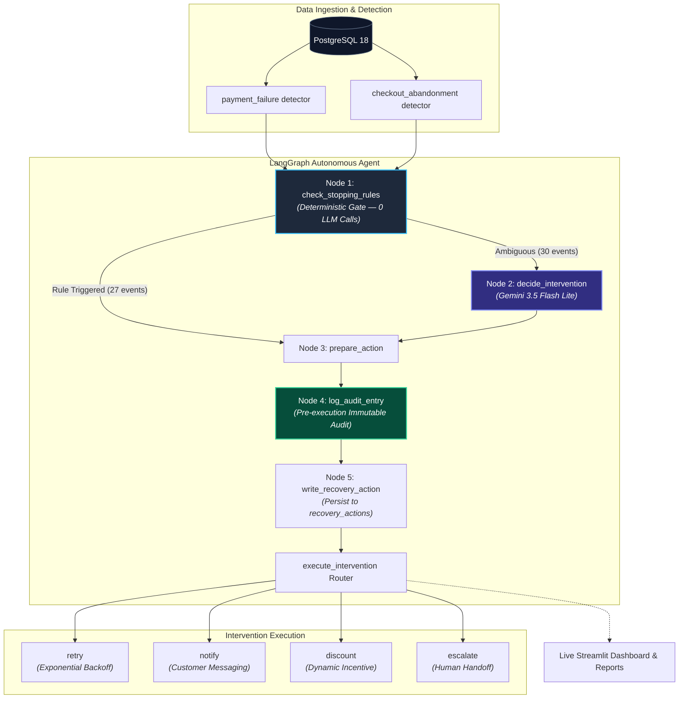

<div align="center">

# Salvage

### Salvage — AI-powered revenue recovery for modern merchants

<p align="center">
  <strong>Autonomous financial agent that detects payment failures and abandoned checkouts, executing bounded recovery actions through deterministic policy gates and Gemini intelligence.</strong>
</p>

[](https://github.com/sm7313617-create/razorpay-revenue-recovery)
[](https://www.python.org/)
[](https://www.postgresql.org/)
[](https://github.com/langchain-ai/langgraph)
[](https://deepmind.google/technologies/gemini/)
[](tests/)
[](reports/recovery_report.json)

---

</div>

## What It Does

When a payment fails or a customer abandons their cart, money is left on the table. This system automatically detects those events from your database, reasons about the best recovery strategy for each one, and acts — all without human intervention for routine cases. For edge cases like bank outages or repeat failures, it escalates to a human queue instead of retrying blindly.

A set of deterministic rules handles the clear-cut cases (too many retries, bank is down, session is stale). Only when those rules don't apply does the system call Gemini to make a judgment call — which keeps the LLM focused on genuinely ambiguous situations rather than burning tokens on obvious ones. Every decision is logged to an audit trail before anything executes, so there's always a record of what the agent decided and why.

A major practical hurdle is data availability: real-world recovery requires clean, structured telemetry, but production payment failures are typically scattered across gateway logs, raw bank response codes, merchant portals, and asynchronous webhook queues — rarely labeled and never in a single queryable place. Salvage addresses this through a deterministic synthetic data layer (`DEFAULT_SEED=1`, reproducible UUID generation, and realistic INR ticket distributions across four failure codes) that models production conditions while keeping every evaluation run strictly auditable and reproducible. Seed 1 was chosen deliberately after benchmarking three candidate seeds, specifically selecting the distribution with a realistic failure mix and genuine escalations over an artificially flattering 100% recovery baseline.

---

## Key Results

> **Benchmark context:** Evaluated on 57 production-grade synthetic events generated with deterministic seed `DEFAULT_SEED=1`.

| Metric | Value |
|---|---|
| **Events processed** | `57` |
| **Recovery rate** | `96.5% (55/57)` |
| **Amount at risk** | `₹8,84,480.75` |
| **Amount recovered** | `₹1,83,559.91` |
| **Improvement over baseline** | `+24.6%` (vs. 71.9% dumb retry baseline) |
| **Gemini decisions** | `30` |
| **Stopping-rule decisions** | `27` |
| **System errors** | `0` |

---

## Architecture

The pipeline is a [LangGraph](https://github.com/langchain-ai/langgraph) `StateGraph` with five nodes: a deterministic policy gate runs first, then (optionally) a Gemini LLM call, then action preparation, audit logging, DB persistence, and finally execution of the chosen intervention. The system runs on PostgreSQL 18 with SQLAlchemy 2.0 and exposes a live Streamlit dashboard.

See [`docs/architecture.md`](docs/architecture.md) for the full ASCII diagram, component breakdown, stopping rules table, and audit schema.



---

## Quick Start

Get the entire revenue recovery pipeline and real-time dashboard running in under 2 minutes:

```bash
# 1. Clone the repository
git clone https://github.com/sm7313617-create/razorpay-revenue-recovery
cd razorpay-revenue-recovery

# 2. Set up virtual environment and install dependencies
python -m venv venv
venv\Scripts\activate
pip install -r requirements.txt

# 3. Configure environment variables (see .env.example)
# Fill in GOOGLE_API_KEY, DB_URL, RAZORPAY_KEY_ID, RAZORPAY_KEY_SECRET

# 4. Initialize PostgreSQL schema and seed deterministic data
python db/setup.py
python -m data.reset_db

# 5. Execute recovery agent pipeline on all 57 events
python run_pipeline.py

# 6. Launch the interactive live Streamlit dashboard
streamlit run dashboard/app.py
```

> [!TIP]
> **Using the Makefile**: On systems with `make` (or using `nmake` on Windows), run `make run` to execute the pipeline or `make dash` to launch the dashboard. Run `make help` to see all targets.

---

## Project Structure

```
razorpay-revenue-recovery/
│
├── run_pipeline.py          # Production entry point — runs full pipeline on all events
├── requirements.txt         # Python dependencies
├── Makefile                 # Convenience targets: help, reset, run, dash, test
├── .env.example             # Environment variable template
│
├── db/
│   ├── models.py            # SQLAlchemy 2.0 ORM models (4 tables)
│   └── setup.py             # Creates tables in PostgreSQL
│
├── data/
│   ├── seed_data.py         # Deterministic test data generator (DEFAULT_SEED=1)
│   └── reset_db.py          # Interactive DB truncate + reseed
│
├── detectors/
│   ├── payment_failure.py   # Detects failed payment events from the DB
│   └── checkout_abandonment.py  # Detects abandoned checkout sessions
│
├── agent/
│   ├── graph.py             # LangGraph StateGraph definition and public API
│   ├── nodes.py             # All 5 node implementations + AgentState type
│   └── prompts.py           # Gemini prompt templates
│
├── interventions/
│   ├── retry.py             # Retry with exponential backoff (mock-safe)
│   ├── notify.py            # Notification and discount offers (mock)
│   └── escalate.py          # Human escalation handoff (mock)
│
├── audit/
│   └── logger.py            # Writes to audit_log before every action
│
├── reports/
│   └── metrics.py           # Aggregates recovery outcomes and financial metrics
│
├── dashboard/
│   └── app.py               # Multi-tab Streamlit dashboard (live DB reads)
│
├── tests/
│   ├── conftest.py          # SQLite in-memory fixtures, no real DB or API calls
│   ├── test_agent.py        # Agent node and stopping-rule unit tests
│   └── test_detectors.py    # Detector logic unit tests
│
└── docs/
    ├── architecture.md      # Full system architecture documentation
    └── debugging_log.md     # Engineering post-mortem ("What Broke at 2 AM")
```

---

## Design Decisions

- **LLM used only for judgment calls** — deterministic stopping rules handle clear-cut fintech cases (bank downtime, max retries, stale sessions) before any Gemini call is made. This keeps LLM usage bounded and auditable.
- **Every agent action logged to `audit_log` before execution** — if an action throws an exception after the log write, the agent's intent is still on record. There are no untracked financial decisions.
- **Hard stopping rules cannot be overridden by the LLM** — once `check_stopping_rules` sets `agent_decision`, the `decide_intervention` node is skipped entirely. The LLM has no path to reverse a policy gate decision.
- **Seed=1 chosen deliberately over seed=42** — seed=42 produced 100% recovery, which is flattering but misleading. Seed=1 produces a realistic failure mix (96.5%, 5 genuine escalations, 30 LLM decisions) that makes the demo credible and the system's limitations visible.

---

## Known Limitations

> [!NOTE]
> **`notify_then_escalate` schema tension**  
> For bank-downtime events, `recovery_actions` records `action_taken='escalate'` and `status='success'`. The `success` here means "successfully dispatched to the human queue" — not "payment recovered." This is a documented design tension: `status` conflates execution outcome with financial outcome. A production system would split these into separate columns.

> [!NOTE]
> **Checkout seed data goes stale**  
> The abandonment detector checks whether a session was abandoned more than 120 minutes ago. Because the seed data uses fixed timestamps, repeated pipeline runs will push more and more checkout sessions past the 120-minute threshold, routing them to the `notify_only` stopping rule instead of Gemini. To restore the original distribution, run `python -m data.reset_db`.

---

## Running Tests

All unit and integration tests run entirely against an in-memory SQLite database, requiring zero external API keys or live PostgreSQL connections.

```bash
.\venv\Scripts\pytest.exe tests/ -v
```

```
============================== 19 passed in 1.42s ==============================
```

---

## What Broke at 2 AM

A transparent engineering post-mortem detailing two production-grade gotchas solved during system construction:

* **Bug 1 — The Silent Escalation**: The `langchain-google-genai` response object returns `.content` as a list of part-dicts, not a plain string. Calling `.strip()` on a list raised a `TypeError` that was swallowed by a broad `except Exception` block, silently falling back to `"escalate"` for every single event. The LLM path had never actually run. Found by printing `response.content` raw instead of trusting the pipeline summary.
* **Bug 2 — The Invisible Escalations**: The metrics aggregation used `status='success'` to infer non-escalation, but `recovery_actions` stores escalations with `action_taken='escalate', status='success'` (success = dispatched, not recovered). All 5 bank-downtime escalations were invisible to the Recovery Analysis tab. Found via direct SQL on the DB; fixed by checking `action_taken == 'escalate'` directly.

Read the full first-person post-mortem in [**`docs/debugging_log.md`**](docs/debugging_log.md).

---

## Tech Stack

| Layer | Technology | Role & Purpose |
|---|---|---|
| **Language** | **Python 3.12.4** | Modern type-hinted core runtime |
| **Database** | **PostgreSQL 18** | Relational store with ACID guarantees |
| **ORM** | **SQLAlchemy 2.0** | Type-safe declarative model mappings |
| **Agent Framework** | **LangGraph** | Cyclic state-graph execution & policy control |
| **LLM Engine** | **Gemini (`gemini-3.5-flash-lite`)** | High-throughput contextual reasoning via `langchain-google-genai` |
| **Dashboard** | **Streamlit** | Live operational observability UI & reporting |
| **Payment SDK** | **Razorpay Test SDK** | Payment attempt verification and integration |
| **Testing** | **pytest** | Deterministic unit & mock integration test suite |

---

<div align="center">
  <sub>Built for the Razorpay Buildathon | Track 03: AI Revenue Recovery</sub>
</div>